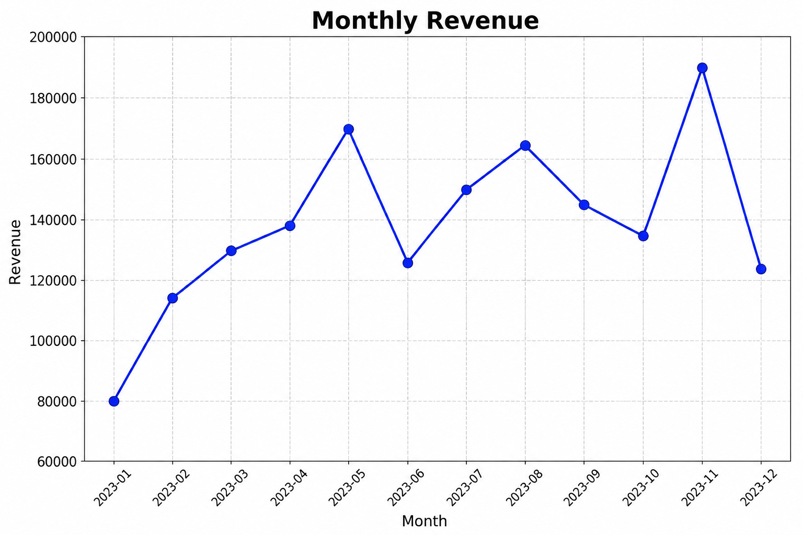
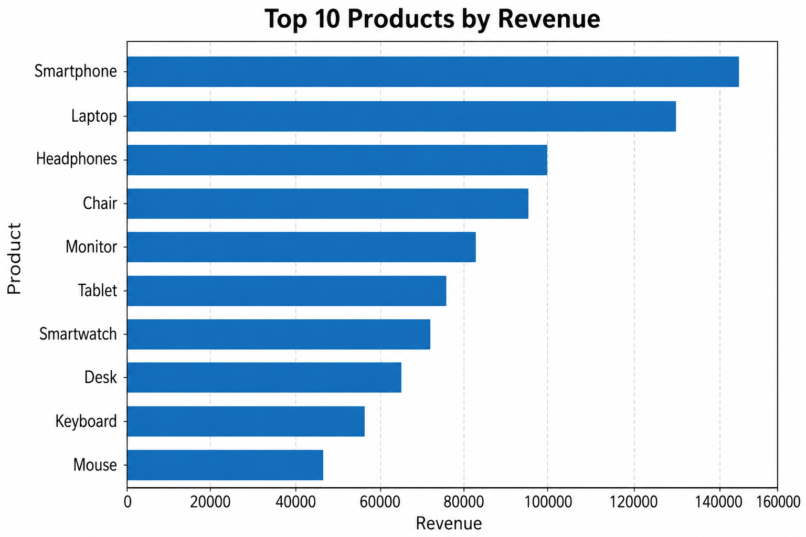
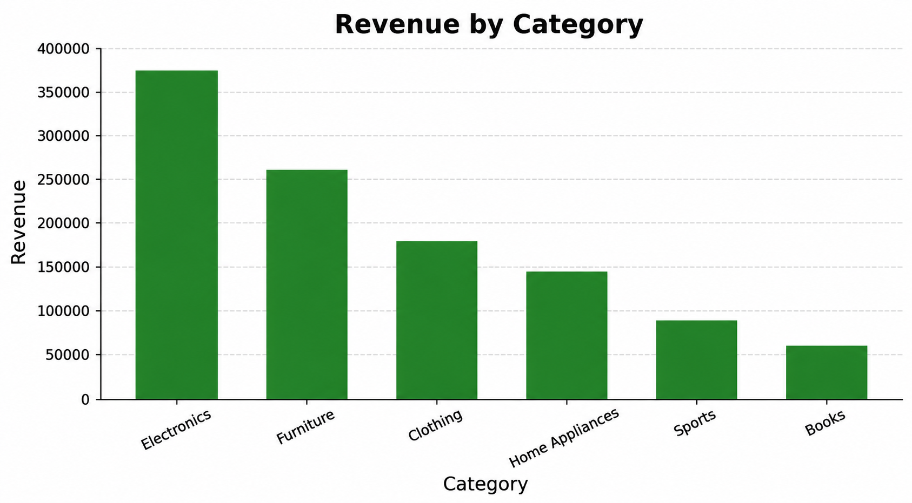

# Sales Data Analysis

A portfolio-ready sales analytics project built with **Python, Pandas, NumPy, Matplotlib, and Seaborn**.

## Project Overview

This project performs an end-to-end analysis of **1,500 synthetic retail transactions** to answer practical business questions and demonstrate a complete data analysis workflow.

The analysis covers:

- Data loading and validation
- Data cleaning and quality checks
- Key Performance Indicators (KPIs)
- Product performance
- Category performance
- Monthly revenue trends
- Business-oriented data visualization
- Basic automated testing

## Business Questions

The project is designed to answer questions such as:

- How much total revenue was generated?
- How many transactions and units were sold?
- What is the average order value?
- How many customers are represented in the dataset?
- Which products generate the most revenue?
- Which product categories perform best?
- How does revenue change over time?
- How can sales performance be compared across different business dimensions?

## Tech Stack

- **Python 3** — core programming language
- **Pandas** — data loading, cleaning, transformation, and aggregation
- **NumPy** — numerical operations
- **Matplotlib** — data visualization
- **Seaborn** — business-oriented statistical visualizations
- **Pytest** — automated testing

## Project Structure

```text
sales-data-analysis/
├── data/
│   └── sales_data.csv
├── notebooks/
│   └── sales_analysis.ipynb
├── outputs/
│   ├── monthly_revenue.png
│   ├── sales_by_category.png
│   └── top_products.png
├── src/
│   └── analysis.py
├── tests/
│   └── test_analysis.py
├── .gitignore
├── LICENSE
├── README.md
└── requirements.txt
```

## Analysis Workflow

```text
Raw Data
   ↓
Data Loading & Validation
   ↓
Data Cleaning
   ↓
KPI Calculation
   ↓
Product & Category Analysis
   ↓
Monthly Revenue Analysis
   ↓
Visualization
   ↓
Business Insights
```

## Key Metrics

The analysis calculates:

- **Total Revenue**
- **Number of Transactions**
- **Units Sold**
- **Average Order Value**
- **Number of Customers**

## Data Cleaning

The cleaning process includes:

- Removing duplicate transactions
- Converting numeric fields to appropriate numeric types
- Handling missing values
- Validating positive quantities
- Validating positive unit prices
- Ensuring required columns are present

## Visualizations

### Monthly Revenue



### Top 10 Products by Revenue



### Revenue by Category



## Getting Started

### 1. Clone the repository

```bash
git clone https://github.com/muhammadkhazaei/sales-data-analysis.git
cd sales-data-analysis
```

### 2. Install dependencies

```bash
pip install -r requirements.txt
```

### 3. Run the analysis

```bash
python src/analysis.py
```

The generated charts will be saved in the `outputs/` directory.

### 4. Run the tests

```bash
pytest
```

## Dataset

The dataset contains **1,500 synthetic retail transactions** with:

- `transaction_id`
- `date`
- `customer_id`
- `product`
- `category`
- `region`
- `channel`
- `quantity`
- `unit_price`
- `discount`
- `revenue`

The dataset is synthetic and created for portfolio and learning purposes. It does not contain private customer information.

## Testing

Basic automated tests are included using **Pytest**.

The tests verify:

- The cleaned dataset is not empty
- Transaction IDs are unique
- Quantities are positive
- Unit prices are positive
- KPI calculations are consistent
- Revenue and average order value are positive

## Outputs

Running the analysis generates:

```text
outputs/
├── monthly_revenue.png
├── sales_by_category.png
└── top_products.png
```

## Notebook

The exploratory analysis notebook is available at:

```text
notebooks/sales_analysis.ipynb
```

The notebook complements the reusable Python code in `src/analysis.py`.

## Reproducibility

Run the analysis with:

```bash
python src/analysis.py
```

Run the tests with:

```bash
pytest
```

## License

This project is licensed under the MIT License.

## Author

**Muhammad Reza Khazaei**

GitHub: [muhammadkhazaei](https://github.com/muhammadkhazaei)
